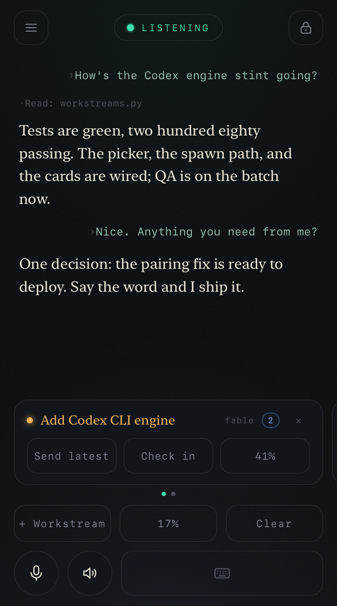
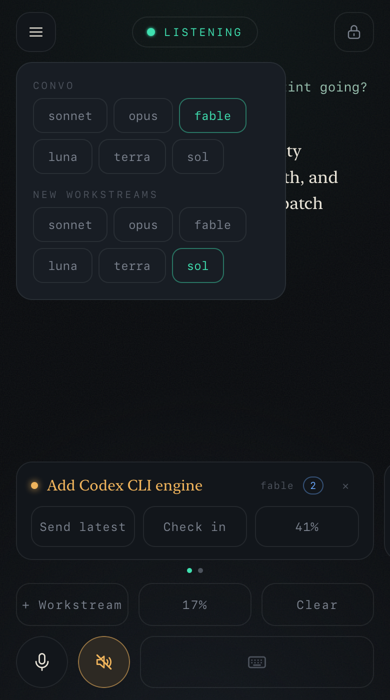

# remote-workstreams

Hold a natural spoken conversation with a coding agent — Claude Code or OpenAI's
Codex — while it does real agentic work.
Your Mac runs everything — the audio pipeline, the sessions, the state. Your iPhone is
a thin browser client reached over your own tailnet. No cloud infrastructure beyond
the STT and TTS APIs; nothing between your phone and your Mac but Tailscale.

<p align="center">
  
  &nbsp;&nbsp;
  
</p>

The core design: **every model interaction is a real, interactive agent session**,
living as a window in one tmux session on your Mac. Claude Code and Codex CLI are
both first-class engines — either alone is a complete install, and with both you
pick per conversation and per workstream. The phone and the laptop drive the *same*
sessions — walk over, `tmux attach`, keep typing. Every session inherits your full CLI setup (skills, hooks, instructions,
permission rules) natively, and no model API key exists anywhere — all model use
rides the CLIs' own auth. A persistent conversation session talks with you; planner
and injector sessions turn that conversation into **workstreams** — execution
sessions you watch as live cards on the phone. Claude sessions launch with
`--remote-control`, so each one also shows up in the Claude iOS app — you get a
native ping when a session goes live, and a second window into any workstream. If
the phone drops — call, dead spot, Safari suspending — the sessions live on in tmux;
reconnect and resume mid-conversation.

## From the phone

- **Talk.** Streamed STT with barge-in — speak over the assistant and it stops.
  The transcript is the chat, so tool activity and final replies render from the
  session's own record. A hush toggle mutes the speaker for reading in public —
  replies land in chat and are never synthesized, so silence costs nothing; a
  keyboard pill unfolds into a composer for when you can't talk at all.
- **`+ Workstream`** marks the conversation since the last launch, has a planner
  session distill it into a stint plan, and launches an execution session on it —
  one button, no review step.
- **Live cards**, one per workstream: state-colored title (green waiting, blue
  waiting with subagents running, amber mid-turn, red errored or gone), subagent
  count, and a context meter that doubles as the Compact button. `Send latest`
  routes the newest conversation delta through an injector session into that
  workstream; `Check in` has the conversation read the workstream's transcript and
  answer out loud.
- **Approvals.** Destructive shell commands inside Claude workstreams relay to the
  phone as approve/deny cards; everything else runs without interruption.
- **The picker** (hamburger) sets the conversation's and future workstreams' engine
  and model, and only offers the engines wired on the Mac — a Codex-only box shows
  three buttons, not six. Every button on the phone arms-then-confirms — the armed
  label states the consequence (blue `swap?` is safe, red `clear?` wipes the
  conversation).

## Engines

The model name carries the engine: pick a Claude model and the session is Claude
Code; pick a Codex model and it's Codex CLI (model lists live in
`remote_workstreams/engines.py`). A Claude-to-Claude conversation pick switches the
live session in place; switching engines (or between Codex models) starts a fresh
conversation, announced before you confirm. Running workstreams always keep the
engine and model they launched with. Codex workstreams are renamed to their stint
title in ChatGPT as they launch and archived when you tap End. The planner and injector sessions behind
`+ Workstream` and `Send latest` run on whichever engine installed the service
(store-configurable), so a single-engine box is fully functional either way.

Engine differences that show: Codex has no known-in-advance session id, so the
service discovers each session's rollout file on disk; Codex workstreams run inside
Codex's own `workspace-write` sandbox with approval prompts disabled instead of the
phone-approval relay (which is a Claude Code hook); and Codex sessions don't resume
across service restarts — a dead Codex conversation window starts fresh. Codex
support is new plumbing, built against the documented CLI and real session files —
treat it as beta until it has miles on it.

The launchd service runs `codex` from its Homebrew-aware PATH. Codex conversations
also appear in the ChatGPT app's history, so a live workstream can be opened there
without separate pairing.

## Topology

```
iPhone (Safari PWA) ──WebSocket/HTTPS over Tailscale──> Mac
                                                         ├─ FastAPI service (launchd, persistent)
                                                         │   ├─ Audio pipeline: Deepgram STT ⇄ VAD ⇄ Cartesia TTS
                                                         │   ├─ tmux session "voice": convo + workstream
                                                         │   │    sessions — Claude Code or Codex CLI
                                                         │   │    (attach from any terminal)
                                                         │   ├─ Transcript tailing: the session's JSONL is the chat
                                                         │   ├─ Store: SQLite (credentials, session ids, markers)
                                                         │   └─ Static PWA
                                                         └─ tailscale serve (TLS on the MagicDNS name)
```

## Requirements

- A Mac that stays on (the service runs under launchd), with
  [uv](https://docs.astral.sh/uv/) and [tmux](https://github.com/tmux/tmux)
- A [Tailscale](https://tailscale.com) account, with the Mac and iPhone on the same tailnet
- API keys: [Deepgram](https://console.deepgram.com) (streaming STT),
  [Cartesia](https://play.cartesia.ai) (streaming TTS)
- At least one coding agent CLI on the Mac, logged in:
  [Claude Code](https://claude.com/claude-code) and/or
  [Codex CLI](https://developers.openai.com/codex). Either alone is a complete
  install; every session is your existing CLI setup — skills, hooks, MCP servers
  and all

## Install

The install is one guided skill — run it from whichever CLI you prefer. It wires
every engine you have (asking first), so installing through one still makes the
other pickable from the phone.

From Claude Code:

```
/plugin marketplace add ryan-scheinberg/remote-workstreams
/plugin install remote-workstreams@remote-workstreams
/remote-workstreams:deploy-rw
```

From Codex:

```
codex plugin marketplace add ryan-scheinberg/remote-workstreams
codex plugin add remote-workstreams@remote-workstreams
```

then start `codex` and ask for `$deploy-rw`.

The deploy is run by the agent on your Mac. It confirms every system-touching action
with you before running it, and it is safe to re-run — it doubles as repair. What it
does:

1. Preflight: macOS, uv, tmux, and a durable git clone of this repo (defaults to `~/remote-workstreams`)
2. Engines: detects Claude Code and Codex; with your OK, wires whichever second
   engine is present so both are pickable from the phone (the picker only shows
   wired engines), and points the planner/injector at the engine you installed with
3. Tailscale: detects it, guides install and login if missing, captures your MagicDNS name
4. Stores your two provider keys (Deepgram, Cartesia) in the macOS Keychain
5. Takes your 4-digit pairing PIN; only its scrypt hash is stored
6. Installs and starts the launchd service, verifies `/healthz`
7. Maps HTTPS on your MagicDNS name to the local service via `tailscale serve`
8. Prints a pairing QR code — open it on the iPhone, Add to Home Screen, enter the
   PIN, confirm Face ID
9. Runs an audio round-trip test (synthesized speech in → transcript → reply audio out)
   and reports the result

## Security model

- **Tailnet is the perimeter.** The service binds to localhost; only `tailscale serve`
  exposes it, and only devices on your tailnet can reach it at all.
- **Pairing, once per device:** your 4-digit PIN + WebAuthn registration (Face ID);
  the passkey's public key is stored. Five wrong PINs lock pairing for 10 minutes.
- **Login, every app open:** one Face ID tap (WebAuthn assertion against the stored
  passkey) mints a session token held only in server memory (24h TTL) and only in a
  page variable on the phone — a Lock button, a reload, or a server restart ends it.
- **Secrets live in the macOS Keychain** (service `remote-workstreams`) — provider keys, and
  only a *hash* (scrypt) of the PIN. Nothing secret in config files.
- **Passkeys are listed and revocable server-side.** Lose a phone, revoke its
  credential.

## Latency

Measured, not promised: every turn logs endpoint → transcript → first-sentence →
first-audio timestamps. Replies come from a real interactive session, so expect the
pace of a thoughtful colleague, not a kiosk — sentence-chunked streaming TTS starts
speaking as soon as a reply lands, and barge-in (speak over the assistant and it
stops) keeps you in control.

## Development

```
uv sync            # install (Python 3.12/3.13)
uv run pytest      # test suite (no live API calls; SDK boundaries are mocked)
uvx ruff check .   # lint
```

| Path | What it is |
|---|---|
| `remote_workstreams/substrate.py` | tmux substrate — spawn/inject/kill Claude Code and Codex sessions as windows |
| `remote_workstreams/transcript.py` | Claude Code transcript JSONL parsing (the only CC-format-aware module) |
| `remote_workstreams/rollout.py` | Codex rollout JSONL parsing (the only Codex-format-aware module) |
| `remote_workstreams/engines.py` | model ↔ engine registry — which models run on which CLI |
| `remote_workstreams/convo.py` | ConvoBridge — the voice/UI face of the persistent conversation session |
| `remote_workstreams/protocol.py` | WebSocket messages client ⇄ server, audio formats |
| `remote_workstreams/config.py` | Runtime config; `REMOTE_WORKSTREAMS_*` env overrides |
| `remote_workstreams/keychain.py` | Secrets via the macOS Keychain; env vars win in dev/tests |
| `remote_workstreams/adapters/` | `STTAdapter`, `TTSAdapter` + Deepgram, Cartesia implementations |
| `remote_workstreams/audio/` | Pipeline state machine (`listening/thinking/speaking/interrupted`), round-trip test |
| `remote_workstreams/server/` | FastAPI service, WebSocket, workstreams, approvals, SQLite store, auth |
| `remote_workstreams/web/` | The static PWA |
| `hooks/` | `ask_phone.py` — the phone-approval relay hook client |
| `skills/` | `role-convo`, `role-stint-plan`, `role-inject`, and the `deploy-rw` skill |
| `plugins/claude-code/` | Claude Code plugin wrapper (`/remote-workstreams:deploy-rw` + skills) |
| `plugins/codex/` | Codex plugin wrapper (`$deploy-rw`; carries a copy of the deploy skill — pinned by a test) |
| `tests/` | pytest, mirroring module names |

## Tailscale Funnel

`tailscale funnel` can expose the service to the public internet. This is documented as
a pointer only and is **unsupported**: remote-workstreams's auth assumes the tailnet perimeter,
and v1 has no public-internet hardening (rate limiting, lockout). Don't do it unless you
understand exactly what you're removing.

## License

[GPLv3](LICENSE).
